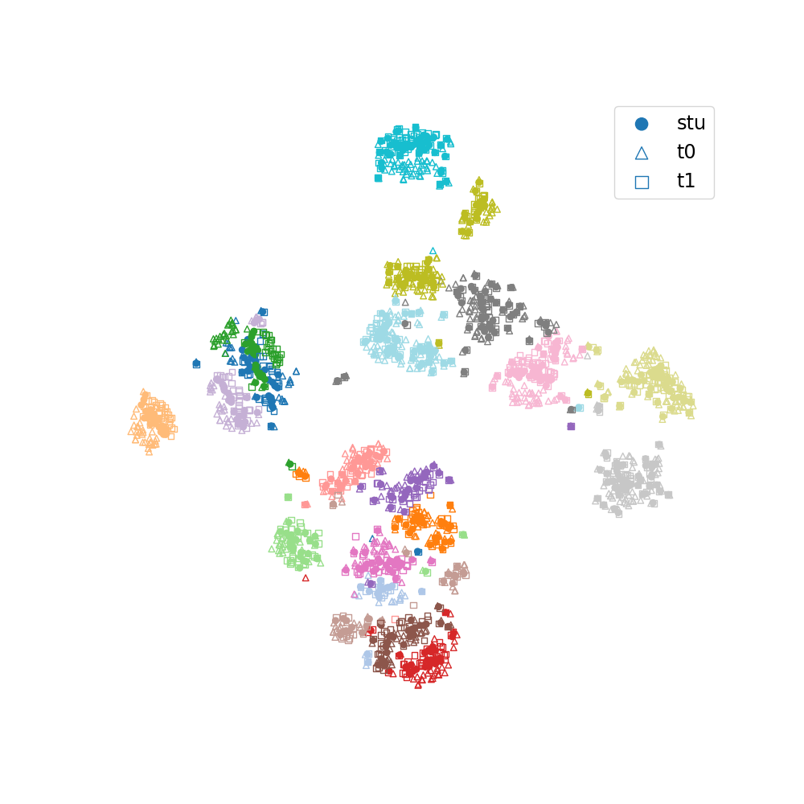
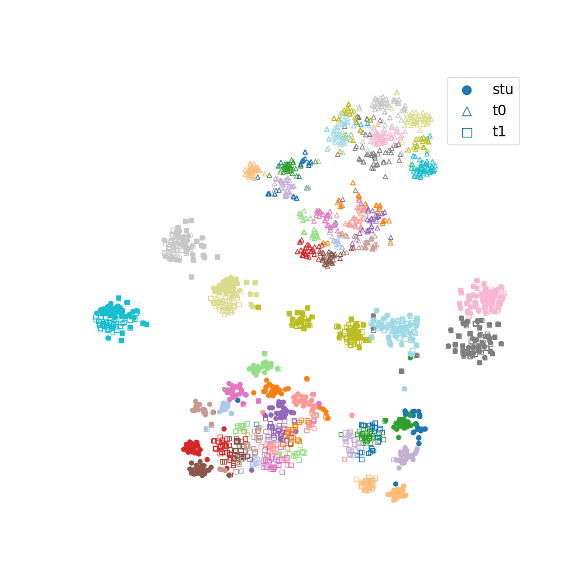
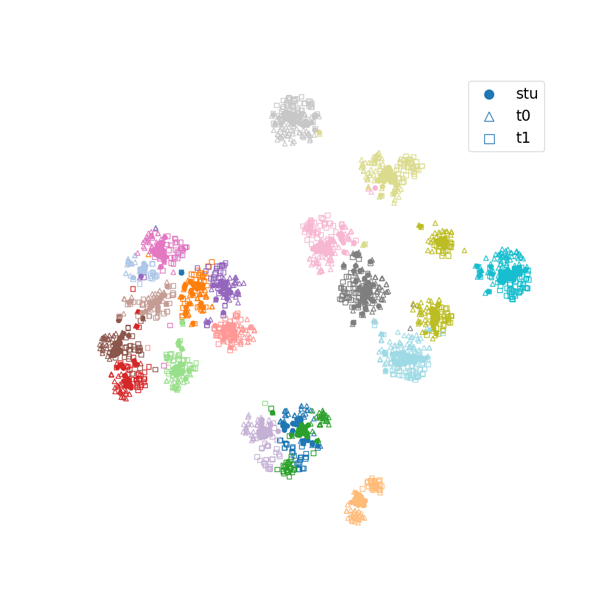
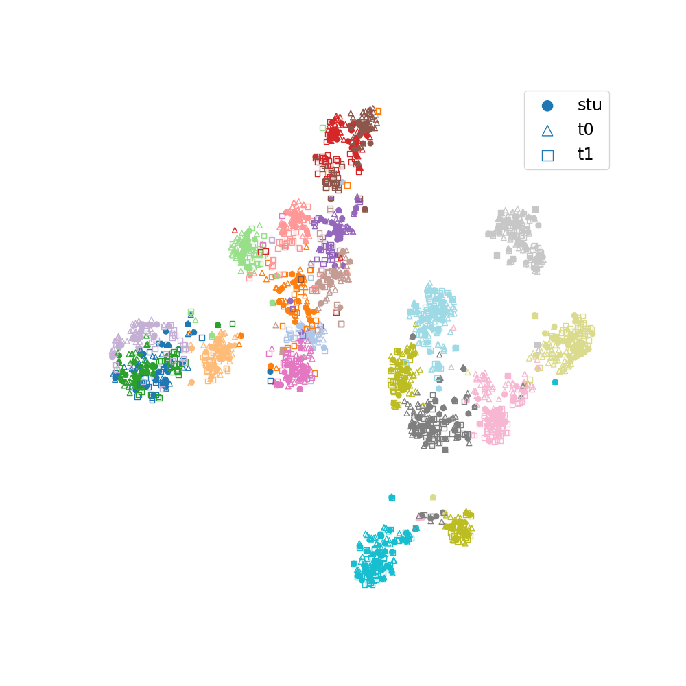

# Common Feature Learning
Official implementation of [Knowledge Amalgamation from Heterogeneous Networks by Common Feature Learning](http://arxiv.org/abs/1906.10546) (*IJCAI 2019*) in pytorch.

<div align="center">

</div>

## Results

### Teacher Performance
Teacher Model   |        Dataset     |    num_classes       |    Acc   
:--------------:|:------------------:|:--------------------:| :-----------:
ResNet18        |   [CUB200](http://www.vision.caltech.edu/visipedia/CUB-200.html)        |     200              |    0.7411
ResNet34        |   [StanfordDogs](http://vision.stanford.edu/aditya86/ImageNetDogs/)     |     120              |    0.8663

### Student Performance (CUB200+StanfordDogs)
Target Model    |    KD       |       CFL   
:--------------:|:-----------:|:-------------------:
ResNet34        |   0.7684    |      **0.7721**
ResNet50        |   0.7965    |      **0.7997** 
DenseNet121     |   0.7769    |      **0.7815**

see *logs* for more information

### Accuracy Curve
<div>


</div>

## TSNE visualization of 20 classes

`Feature Space`: space constructed with intermediate outputs.  
`Common Space`: common feature space in CFL Blocks.

**Some Feature spaces are None because of different feature dimensions (e.g. 2048 for ResNet50 but 512 for ResNet34)**

Target Model   |  Common Space             |  Feature Space
:----------:|:-------------------------:|:-------------------------:
ResNet34  |   |  
ResNet50  |   |   None
DenseNet121  |   |   None

## Quick Start

#### 1. Download Datasets
```bash
python download_data.py
```

#### 2. Get Trained Teacher Models
ResNet18 & ResNet34, 242.9 MB  
[Google Drive](https://drive.google.com/open?id=1cMOwJlf4S9fGwWv4hSXnpSwSrwGkGW94)  
[BaiDu Yun](https://pan.baidu.com/s/1qydtKOSn8vVUkqWjuyHblA)  

#### 3. Train
```bash
python amal.py --model resnet34 --gpu_id 0 --lr 1e-4 --cfl_lr 5e-4
```
or
```bash
bash run_all.sh
```

#### 4. Draw Accuracy Curve
```bash
cd logs/
python draw_acc_curve.py
```

#### 5. TSNE
```bash
# ResNet34
python tsne_common_space.py --ckpt checkpoints/amal_resnet34_best.pth --t1_ckpt checkpoints/cub200_resnet18_best.pth --t2_ckpt checkpoints/dogs_resnet34_best.pth --gpu_id 0

# ResNet50
python tsne_common_space.py --ckpt checkpoints/amal_resnet50_best.pth --t1_ckpt checkpoints/cub200_resnet18_best.pth --t2_ckpt checkpoints/dogs_resnet34_best.pth --gpu_id 0

# DenseNet121
python tsne_common_space.py --ckpt checkpoints/amal_densenet121_best.pth --t1_ckpt checkpoints/cub200_resnet18_best.pth --t2_ckpt checkpoints/dogs_resnet34_best.pth --gpu_id 0
```

## Citation
```
@article{luo2019knowledge,
  title={Knowledge Amalgamation from Heterogeneous Networks by Common Feature Learning},
  author={Luo, Sihui and Wang, Xinchao and Fang, Gongfan and Hu, Yao and Tao, Dapeng and Song, Mingli},
  journal={arXiv preprint arXiv:1906.10546},
  year={2019}
}
```